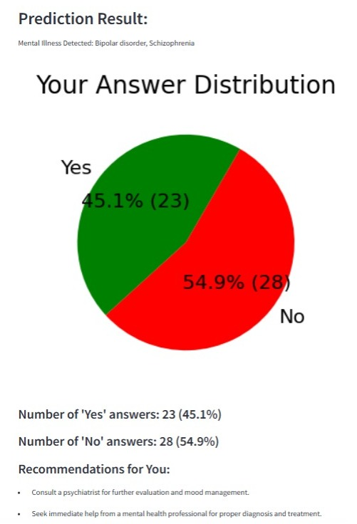
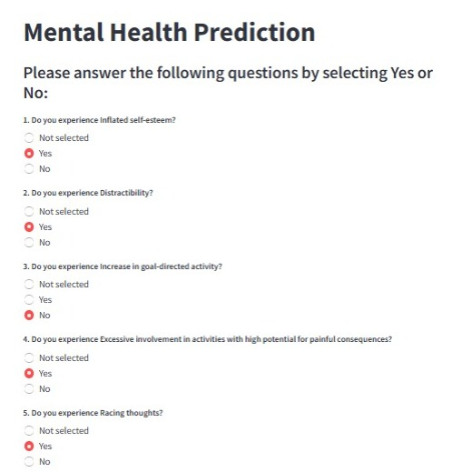

# 🧠 Mental Health Diagnosis Tool

This is a **Streamlit-based Mental Health Prediction Web App** that uses user responses to assess potential mental health conditions like *Bipolar Disorder* and *Schizophrenia*. The tool is based on **DSM-5 diagnostic criteria** and provides visual feedback and recommendations.

---

## 📸 Screenshots
### Prediction Results


### Questionnaire


---

## 🚀 Features
- **Interactive Questionnaire**: Users can answer multiple questions related to mental health.
- **Condition Prediction**: Get potential diagnoses based on the DSM-5 criteria.
- **Answer Distribution**: Visual representation of your responses using pie charts.
- **Personalized Recommendations**: Suggestions for further steps based on results.

---

## 🛠️ Tech Stack
- **Language**: Python
- **Framework**: Streamlit
- **Key Libraries**:
  - `pandas` for data manipulation
  - `matplotlib` for data visualization
  - `numpy` for numerical processing

---

## 🚀 Streamlit
- https://mentalhealthdiagnosis-1.streamlit.app/

## 🏃 How to Run
1. Clone the repository:
   ```bash
   git clone https://github.com/your-username/mental-health-diagnosis.git
   cd mental-health-diagnosis
